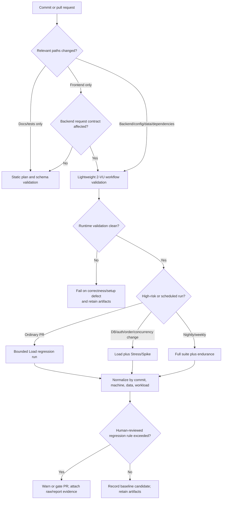

# Continuous Performance Testing Proposal

Status: **PROPOSAL — NOT DEPLOYED**

## Objective

Continuously assess performance risk without running an expensive suite on
every source change. The model observes commits and pull requests, classifies
the changed paths, selects a proportional k6 suite, preserves raw data, and
compares like-for-like results from controlled runners.

## Change decision model

| Change class | Examples | Proposed action |
|---|---|---|
| Documentation or test comments | `docs/**`, prose-only changes | Static validation only |
| Public data/test harness | k6 library, CSV schema, runner | Init validation plus 2-VU workflow validation |
| Authentication | login, JWT, lockout, users schema | Validation Pilot plus Load; Stress on high-risk changes |
| Read path | product search/detail or database query | Load; Stress when query/index/data shape changes |
| Transactional path | checkout, order state, SQLite configuration | Load + Stress + Spike |
| Runtime/dependency | Node, sqlite3, k6, OS image | Full compatibility validation; full suite if execution semantics change |
| Scheduled assurance | nightly/weekly | Full three-scenario suite; periodic endurance |

## Baselines and p95 regression detection

- Store immutable native k6 JSON, summary JSON, workload/data manifest, commit,
  runner identity, tool version, and environment fingerprint for each accepted
  baseline.
- Compare only the same workflow, workload, data seed, k6 version, runner class,
  and endpoint tag.
- Calculate endpoint and workflow p50/p90/p95/p99, throughput, failure rate, and
  lifecycle success from raw data—not copied console text.
- Flag p95 regressions relative to an accepted baseline. The percentage/tolerance
  is intentionally configuration-driven and **not finalized here** because the
  human review found no repeat-run/noise evidence for the AI's earlier numeric
  margins.
- Require repeated confirmation or a sufficiently large effect before a hard PR
  gate. Until noise is characterized, publish warnings with artifacts rather
  than failing on small latency movement.

## Noise and runner consistency

Pin k6, Node/dependencies, source commit, workload, seed, account pool, and
machine class. Use a fresh disposable database and identical preconditioning.
Reserve the runner, close unrelated heavy applications, record free disk and
resource context, and separate setup/warm-up from measured traffic. Prefer
multiple repetitions and compare distributions/medians before accepting a new
baseline.

## Cost and risk trade-offs

Lightweight validation reduces PR cost but can miss concurrency and endurance
regressions. Full suites catch more state/concurrency behavior but consume
runner time and can delay feedback. Noisy shared runners cause false alarms;
over-wide tolerances cause false negatives. A warning-first policy, path-based
selection, periodic full runs, and retained raw artifacts balance those risks.

## Gating and retention

- Correctness/setup failures: hard fail because the intended workflow did not
  execute.
- Confirmed regression against a human-reviewed rule: PR warning first, hard
  gate only after noise/repeatability evidence exists.
- Safety failure: stop the owned run and preserve diagnostic artifacts.
- Retain PR summaries for trend history and full raw artifacts for failed,
  baseline, release, and scheduled full-suite runs. Apply an explicit retention
  period to routine passing runs; never silently discard assignment evidence.

The example configuration at
[`ci/performance-prototype.yml`](ci/performance-prototype.yml) is deliberately
stored outside `.github/workflows/`; it is a reviewable prototype and is not
claimed to be deployed.
